## Hi , I am ApolloMonasa!

I am a sophomore undergraduate student majoring in Computer Science from Hangzhou Dianzi University.

**Recently, I'am working on :**
- Netease game demo development
- Reviewing
- Java and Go learning
<!-- 仅在深色模式下显示 -->

<!-- 仅在浅色模式下显示 (可选，可以只用一种) -->

## Tech Stack

### Frontend

  

### Backend

<strong>Languages & Frameworks</strong>

<strong>Database Development</strong>

<strong>AscendC Operator Development</strong>

